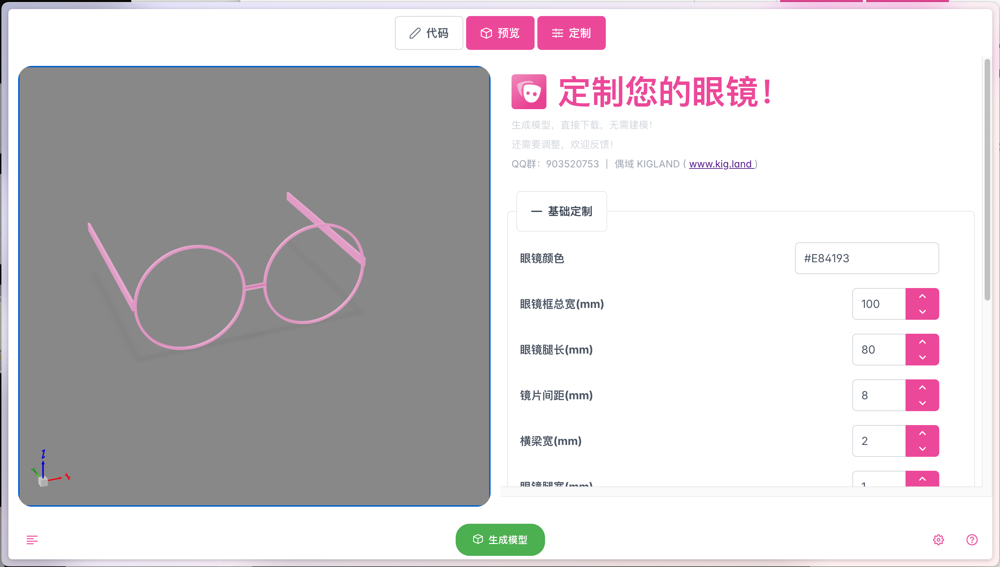

# GLASSES - 在线眼镜定制工具

GLASSES 是一个基于 Web 的眼镜定制工具，让用户能够轻松地在线设计和预览自己的眼镜模型。



## ✨ 特性

- 🎨 实时预览：修改参数即时查看效果
- 📱 响应式设计：完美支持电脑和手机访问
- 💾 一键导出：直接下载 3D 模型文件
- 🎮 交互式 3D 预览：可以自由旋转、缩放查看模型
- ⚡ 快速渲染：采用高效的 WebAssembly 技术
- 🎯 简单易用：无需建模经验，通过参数即可调整

## 🚀 快速开始

1. 访问 [www.kig.land](https://www.kig.land) 
2. 调整眼镜参数，实时预览效果
3. 满意后点击下载，获取模型文件

## 🛠️ 开发相关

### 环境要求

- Node.js
- npm 或 yarn
- Docker（用于构建 WebAssembly）

### 本地开发

```bash
# 安装依赖
npm install

# 启动开发服务器
npm start

# 构建生产版本
npm run build
```

## 📝 许可证

本项目基于 GPL 许可证开源。详见 [LICENSE](./LICENSE.md) 文件。

## 🤝 反馈与支持

- QQ 群：903520753
- 官网：[www.kig.land](https://www.kig.land)

## 👥 关于我们

GLASSES 项目由 KIGLAND 团队开发维护。我们致力于为用户提供简单易用的在线眼镜定制工具。
